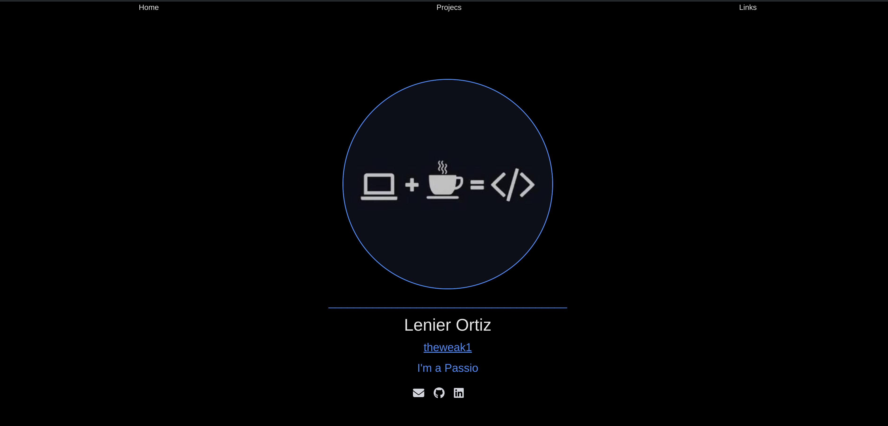
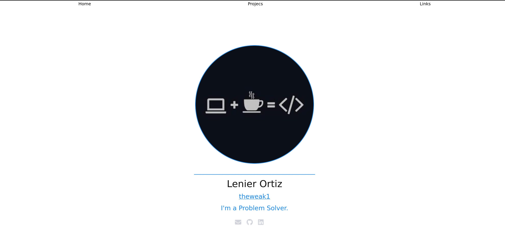

<h1><a href="https://theweak1.github.io/theweak1.github.io">theweak1.github.io</a></h1>

This is the source for my personal portfolio site of the same name.
[Live version][live_version].

Feel free to fork it for your own use.

## Important

This project is inspired and modified from a couple of projects. see below the list of the original projects from where inspiration was taken

- Personal Portfolio project. The original can be found [here](https://github.com/2KAbhishek/2kabhishek.github.io).
- Project for displaying your projects. The original can be found [here](https://github.com/2KAbhishek/projects).
- List of links project. The original can be found [here](https://github.com/2KAbhishek/links).

All of this projects are from the user [2KAbhishek](https://github.com/2KAbhishek)

Run `npm install` after clone to install all the required dependencies.

## Configuration

There are a comple of areas where you can modify this project so you can make it your own,

- Starting by `/src/Routes/routes.jsx`, here you can change the `Title` for each individual page. And if you want, you can add your own pages by following the structure.

- You can also modify the `/src/configuration/links.js`, here you can modify, add or remove the `links` for your socials, or places where people can find you.

- You can modify the `Skills` by changing the `/src/configuration/skils.js`, here you can add or remove skill.

- You may also modify the `adjetives` that are displayed with the typewriter effect. to do this change the `/src/configuration/adjetive.js`.

  - If you wish to change the timing for the `typewriting` effect, you can do so by modifying the constructor `useTypewriter` withing the `/src/Pages/home/Home.jsx` file.

---

- Also you can modify the `/src/configuration/configuration.js`, this values are used for getting and displaying the github repos under your username.
  - The number of repos is controlled by the maxPages variable, the GitHub API supports 100 repos per page max. If you have less than 100 repos, set maxPages to 1, if you have 300 then 3.
  - Forked repos are hidden by default, to show them set `hideForks = false`

## Themes

Comes with a dark and light theme by default, depends upon your system configs. Edit the variables under `theme/extend/colors` in the `tailwind.config.js` to modify colorscheme.

## Programming Language Icons

This project uses [Devicon](https://devicon.dev) for adding language icons, if the language name and icon are not being displated correctly for any f your repos, update `devicons` mapping in the `/src/components/Pages/projects/dispayRepos/devicons/devicons.jsx`.

## Viewing projects

Open `index.html` in your favorite browser or visit [theweak1.github.io/projects](https://theweak1.github.io/projects).

## How it was build

Project was build using `React` with `vite`, `tailwindcss` & `javascript`. It was build using neovim as my code editor. Uses Github API for data and Devicons for programming icons.

## What I learned

- Learned about a few quirks of the fetch API, especially implementation of `maxPages`.
- Flex, box-shadow and some other CSS tricks were revisited.

## What's next

You tell me!

Hit the ⭐ button if you found this useful.

## More Info

<a href='https://github.com/theweak1/theweak1.github.io'> Source</a> | <a href='https://theweak1.github.io'>Website</a>

[live_version]: https://theweak1.github.io
[original_project]: https://github.com/2KAbhishek/2kabhishek.github.io
